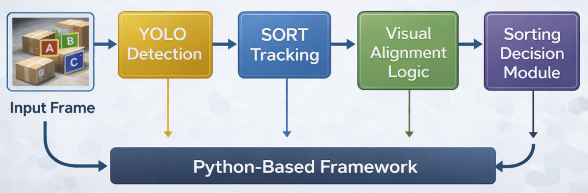
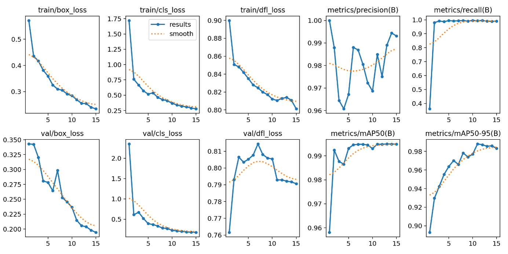
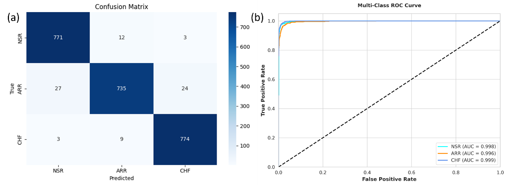

# 🧭 Autonomous Vision-Based Conveyor Sorting System

Real-time detection, tracking, and autonomous sorting-command generation for
objects moving on a conveyor belt — built with YOLOv11 and tracker-native
multi-object association, with a Streamlit deployment interface.

<p align="center">
  
  <br/>
  <em>Original modular design (detection → tracking → alignment → decision).
  The tracking stage was later corrected from index-based SORT to tracker-native
  class association — see <a href="#-a-defect-found-measured-and-fixed">the fix below</a>.</em>
</p>

---

## Overview

Modern warehouse sorting relies on costly robotic arms, RFID, or barcode
infrastructure. This project explores a **lightweight, vision-only alternative**:
a single camera watching a conveyor, a deep-learning detector, a multi-object
tracker, and a rule-based decision module that issues one sorting command per
object — no specialised hardware.

The pipeline runs end-to-end on ordinary video, in a notebook or through a
live Streamlit app.

```
Video frame  →  YOLOv11 detection  →  identity tracking  →  zone crossing  →  sorting command
```

---

## ✨ Key features

- **YOLOv11 detector** trained on a conveyor "cube-on-belt" dataset (3 box classes).
- **Tracker-native class association** — each object's class travels with its
  identity, eliminating a class-mismatch defect present in the original SORT
  implementation.
- **Sorting-zone gating** — a command fires *once*, at the moment an object's
  centre crosses a fixed line, enforcing one-command-per-object.
- **Streamlit deployment** — choose *upload video* or *live webcam*, and watch
  detection, tracking, and commands overlaid in real time.
- **Instrumented validation** — a measurement script quantifies command
  stability (flips, switches, purity) as objective evidence, not screenshots.

---

## 🎯 Command mapping

| Detected box | Sorting command |
|:---:|:---:|
| 🔵 Blue | **LEFT** |
| 🔴 Red | **RIGHT** |
| ⚪ White | **FORWARD** |

---

## 🧠 How the sorting zone works

A detector knows *what* each object is and a tracker knows *which* object it is —
but neither decides *when* to act. On a moving belt an object is visible for many
frames, so firing a command every frame would trigger a diverter dozens of times
for one box.

The **sorting zone** gates the decision to a single moment: the command commits
only when the object's centre **crosses** a fixed line. A sign-change test,

```
(c_prev − L) · (c_curr − L) ≤ 0
```

detects the crossing at any speed — unlike a proximity window, which a fast box
can skip between frames. Each identity fires exactly once.

---

## 🐛 A defect found, measured, and fixed

The original pipeline paired SORT tracks with YOLO classes **by list index**
(`classes[i]`). Because SORT reorders and filters detections during association,
that index no longer points at the same object — so tracks were frequently
assigned the wrong class, and therefore the wrong command.

This was **instrumented and measured** on a fixed test clip (192 frames,
10 tracked objects):

| Pipeline | Command flips | Switches | Mean purity |
|---|:---:|:---:|:---:|
| SORT + index assignment (original) | 135 | 18 | 0.656 |
| Tracker-native class association (fixed) | **0** | **0** | **1.000** |

> Purity 0.656 means each object spent only ~66 % of its frames on its correct
> command. Carrying the class through the tracker's identity association fixed it
> at the root — **not** a smoothing filter over the symptom.

*(`purity` = mean fraction of a track's frames on its dominant command; 1.000 = perfectly stable.)*

---

## 📊 Detector comparison

Three architectures were trained on the same dataset and configuration;
YOLOv11 was selected.

| Model | Precision | Recall | mAP@50 | mAP@50-95 | Inference (ms) |
|---|:---:|:---:|:---:|:---:|:---:|
| YOLOv7 | 96.40 | 97.10 | 97.80 | 96.20 | 5.2 |
| YOLOv8 | 97.25 | 98.30 | 98.90 | 97.60 | 4.8 |
| **YOLOv11 (selected)** | **98.47** | **99.28** | **99.48** | **98.80** | **3.3** |

<p align="center">
  
  <br/><em>Loss convergence, PR improvement, and mAP growth during training.</em>
</p>

<p align="center">
  
  <br/><em>Confusion matrix and F1–confidence curve for the YOLOv11 model.</em>
</p>

---

## 🖥️ Sorting event log (sample)

Each row is one autonomous sorting event — a distinct object crossing the zone once.

| Frame | Object ID | Command |
|:---:|:---:|:---:|
| 6 | 1 | LEFT |
| 8 | 2 | FORWARD |
| 33 | 3 | RIGHT |
| 41 | 4 | LEFT |
| 82 | 5 | FORWARD |
| 85 | 6 | LEFT |
| 108 | 7 | LEFT |
| 158 | 8 | RIGHT |

---

## 🚀 Getting started

### Install
```bash
git clone <your-repo-url>
cd <repo>
python -m venv venv
venv\Scripts\activate        # Windows  (source venv/bin/activate on Linux/Mac)
pip install -r requirements.txt
```

`requirements.txt`:
```
ultralytics
opencv-python
numpy
streamlit
matplotlib
```

### Run the notebook pipeline
Open `notebooks/pipeline.ipynb`, set `VIDEO_PATH` and `MODEL_PATH`, run all cells.

### Run the live app
```bash
streamlit run app.py
```
Pick **Upload video** or **Live webcam**, set your weights path, hit **Deploy**.

> ⚠️ The live-webcam option opens the camera of the machine running the app, so it
> is intended for **local** use. The upload-video path works anywhere.

### Reproduce the stability measurement
```bash
python experiment_smoothing.py
```
Prints the flips / switches / purity table above.

---

## 📁 Repository structure

```
├── app.py                    # Streamlit deployment interface
├── notebooks/
│   └── pipeline.ipynb        # end-to-end detection → tracking → sorting
├── experiment_smoothing.py   # command-stability measurement (validation)
├── weights/
│   └── best.pt               # trained YOLOv11 weights
├── docs/                     # figures used in this README
└── requirements.txt
```

---

## 🧩 What is authored vs. reused

| Component | Origin |
|---|---|
| YOLOv11 detector (weights trained here) | Ultralytics framework |
| Multi-object tracking | SORT / BoT-SORT (library) |
| Class-through-identity association fix | **Authored** |
| Sorting-zone crossing logic | **Authored** |
| Detection → command mapping | **Authored** |
| Stability measurement instrument | **Authored** |
| Streamlit deployment interface | **Authored** |

---

## ⚠️ Limitations & honest notes

- Live-webcam capture is local-only (no browser capture layer).
- The zone assumes objects are tracked continuously through the line; if the
  tracker drops and re-acquires an object at the line, that crossing can be
  missed. Measured fired-count matched the countable objects on the test clip.
- Detector metrics are on the project's own conveyor dataset; performance on
  other belts/lighting is not yet characterised.

---

## 📜 License

Specify your license here (e.g. MIT).
